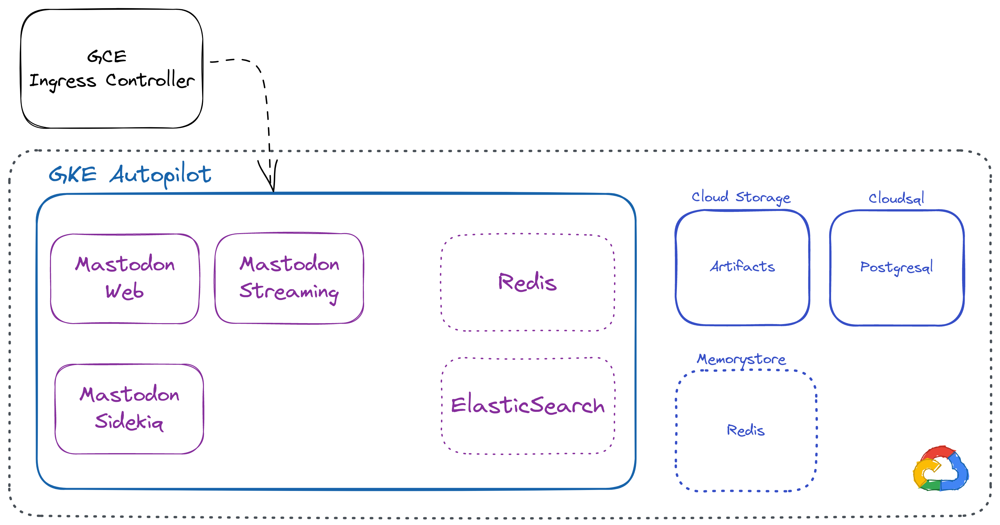

# Terraform GKE Autopilot mastodon module

This is a Terraform module to install and configure a Mastodon instance in a GKE Autopilot cluster
using the official [GitLab Runner Helm Chart](https://gitlab.com/gitlab-org/charts/gitlab-runner).

This module is provided without any kind of warranty and is AGPL3 licensed.

## Architecture

## Pricing model

> TODO: Pricing should be still finalized.

At the moment of writing, the architecture is composed of the following components:

## Using Redis in Memorystore

1.  GKE Autopilot - 1 control plane [free of charge][1] per billing account, otherwise around - **70$/monthly**
2.  Cloudsql tier: [db\-g1-small][2] **- 25$/monthly**
3.  Memorystore Redis 1GB - **35$/monthly**
4.  5 GKE Replicas (web, streaming, worker) as "0.5 CPU / 512MB" using spot nodes - **25$/Monthly**

For a total of:

- GKE Autopilot free-tier: **85$/monthly**
- GKE Autopilot: **155$/monthly**

## Using Redis in GKE

1.  Redis master - "0.250 CPU / 512MB" - **8$**
2.  Redis replicas 3 x 0.250 CPU / 512MB on Spot nodes - **7$**

For a total of:

- GKE Autopilot free-tier: **65$/monthly**
- GKE Autopilot: **135$/monthly**

[1]: https://cloud.google.com/kubernetes-engine/pricing#cluster_management_fee_and_free_tier
[2]: https://cloud.google.com/sql/pricing
