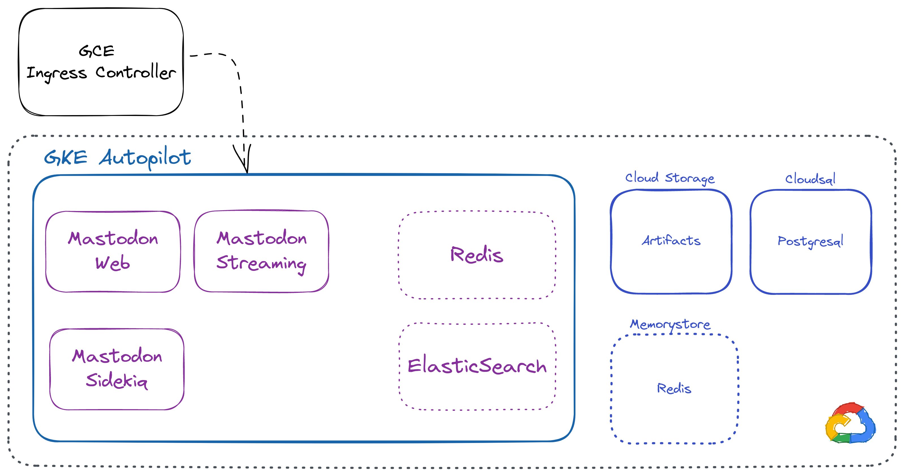

<!-- BEGIN_TF_DOCS -->
# Terraform GKE Autopilot mastodon module

This is a Terraform module to install and configure a Mastodon instance in a GKE Autopilot cluster
using the official [GitLab Runner Helm Chart](https://gitlab.com/gitlab-org/charts/gitlab-runner).

This module is provided without any kind of warranty and is AGPL3 licensed.

## Architecture

## Pricing model

At the moment of writing, the architecture is composed of the following components:

## Using Redis in Memorystore

1.  GKE Autopilot - 1 control plane [free of charge][1] per billing account, otherwise around - **70$/monthly**
2.  Cloudsql tier: [db\-g1-small][2] **- 25$/monthly**
3.  Memorystore Redis 1GB - **35$/monthly**
4.  5 GKE Replicas (web, streaming, worker) as "0.5 CPU / 512MB" using spot nodes - **25$/Monthly**

For a total of:

- GKE Autopilot free-tier: **85$/monthly**
- GKE Autopilot: **155$/monthly**

## Using Redis in GKE

1.  Redis master - "0.250 CPU / 512MB" - **8$**
2.  Redis replicas 3 x 0.250 CPU / 512MB on Spot nodes - **7$**

For a total of:

- GKE Autopilot free-tier: **65$/monthly**
- GKE Autopilot: **135$/monthly**

> NOTE: Elasticsearch integration is not yet finished.

[1]: https://cloud.google.com/kubernetes-engine/pricing#cluster_management_fee_and_free_tier
[2]: https://cloud.google.com/sql/pricing
## Providers

| Name | Version |
|------|---------|
|  [google](#provider\_google) | ~> 4.39.0 |
|  [google-beta](#provider\_google-beta) | ~> 4.48.0 |
|  [helm](#provider\_helm) | ~> 2.5 |
|  [kubectl](#provider\_kubectl) | >= 1.7.0 |
|  [kubernetes](#provider\_kubernetes) | ~> 2.12 |
|  [random](#provider\_random) | ~> 3.1 |
## Requirements

| Name | Version |
|------|---------|
|  [terraform](#requirement\_terraform) | >= 1.3 |
|  [google](#requirement\_google) | ~> 4.39.0 |
|  [google-beta](#requirement\_google-beta) | ~> 4.48.0 |
|  [helm](#requirement\_helm) | ~> 2.5 |
|  [kubectl](#requirement\_kubectl) | >= 1.7.0 |
|  [kubernetes](#requirement\_kubernetes) | ~> 2.12 |
|  [random](#requirement\_random) | ~> 3.1 |
## Inputs

| Name | Description | Type | Default | Required |
|------|-------------|------|---------|:--------:|
|  [app\_admin\_email](#input\_app\_admin\_email) | Admin email | `string` | `"not@localhost"` | no |
|  [app\_admin\_username](#input\_app\_admin\_username) | Admin username | `string` | `"not_gargron"` | no |
|  [app\_create\_admin](#input\_app\_create\_admin) | Create admin account | `bool` | `false` | no |
|  [app\_existing\_secret\_name](#input\_app\_existing\_secret\_name) | Mastodon existing secret name | `string` | `null` | no |
|  [app\_helm\_additional\_values](#input\_app\_helm\_additional\_values) | Additional values to pass to the helm | `string` | `""` | no |
|  [app\_keys](#input\_app\_keys) | Mastodon secret keys | `set(string)` | <pre>[   "secret_key_base",   "otp_secret" ]</pre> | no |
|  [app\_locale](#input\_app\_locale) | Mastodon locale | `string` | `"en"` | no |
|  [app\_s3\_existing\_secret](#input\_app\_s3\_existing\_secret) | S3 existing secret name | `string` | `null` | no |
|  [app\_smtp\_existing\_secret](#input\_app\_smtp\_existing\_secret) | SMTP existing secret name | `string` | `null` | no |
|  [app\_smtp\_password](#input\_app\_smtp\_password) | SMTP password | `string` | `null` | no |
|  [app\_smtp\_username](#input\_app\_smtp\_username) | SMTP username | `string` | `null` | no |
|  [app\_vapid\_private\_key](#input\_app\_vapid\_private\_key) | Mastodon vapid private key | `string` | `null` | no |
|  [app\_vapid\_public\_key](#input\_app\_vapid\_public\_key) | Mastodon vapid public key | `string` | `null` | no |
|  [bucket\_force\_destroy](#input\_bucket\_force\_destroy) | Force destroy bucket | `bool` | `false` | no |
|  [bucket\_location](#input\_bucket\_location) | Bucket location | `string` | n/a | yes |
|  [bucket\_storage\_class](#input\_bucket\_storage\_class) | The Storage Class of the new bucket. | `string` | `null` | no |
|  [bucket\_versioning](#input\_bucket\_versioning) | Enable bucket versioning | `bool` | `true` | no |
|  [cloudsql\_backup\_retained\_count](#input\_cloudsql\_backup\_retained\_count) | Numeber of postgres backup to be retained. Default 30. | `number` | `"30"` | no |
|  [cloudsql\_backup\_start\_time](#input\_cloudsql\_backup\_start\_time) | HH:MM format time indicating when postgres backup configuration starts. | `string` | `"02:00"` | no |
|  [cloudsql\_deletion\_protection](#input\_cloudsql\_deletion\_protection) | Enable deletion protection for the cloudsql instance. | `bool` | `false` | no |
|  [cloudsql\_disk\_size](#input\_cloudsql\_disk\_size) | The disk size for the master instance. | `number` | `10` | no |
|  [cloudsql\_disk\_type](#input\_cloudsql\_disk\_type) | The disk type for the master instance. | `string` | `"PD_SSD"` | no |
|  [cloudsql\_enable\_backup](#input\_cloudsql\_enable\_backup) | Setup if postgres backup configuration is enabled.Default true | `bool` | `true` | no |
|  [cloudsql\_pgsql\_version](#input\_cloudsql\_pgsql\_version) | value of the postgresql version | `string` | `"POSTGRES_14"` | no |
|  [cloudsql\_tier](#input\_cloudsql\_tier) | The tier of the master instance. | `string` | `"db-g1-small"` | no |
|  [cloudsql\_zone](#input\_cloudsql\_zone) | Cloudsql | `string` | n/a | yes |
|  [domain](#input\_domain) | This is the unique identifier of your server in the network. It cannot be safely changed later, as changing it will cause remote servers to confuse your existing accounts with entirely new ones. It has to be the domain name you are running the server under (without the protocol part, e.g. just example.com). | `string` | n/a | yes |
|  [gcp\_default\_labels](#input\_gcp\_default\_labels) | Default labels to apply to all resources | `map(string)` | `null` | no |
|  [gke\_authenticator\_security\_group](#input\_gke\_authenticator\_security\_group) | The security group to allow access to the cluster | `string` | n/a | yes |
|  [gke\_datapath\_provider](#input\_gke\_datapath\_provider) | The GKE datapath provider to use | `string` | `"ADVANCED_DATAPATH"` | no |
|  [gke\_maintenance\_end\_time](#input\_gke\_maintenance\_end\_time) | The end time for the maintenance window | `string` | `"1970-01-01T04:00:00Z"` | no |
|  [gke\_maintenance\_recurrence](#input\_gke\_maintenance\_recurrence) | The recurrence for the maintenance window | `string` | `"FREQ=WEEKLY;BYDAY=MO,TU,WE,TH,FR,SA,SU"` | no |
|  [gke\_maintenance\_start\_time](#input\_gke\_maintenance\_start\_time) | The start time for the maintenance window | `string` | `"1970-01-01T00:00:00Z"` | no |
|  [gke\_zone](#input\_gke\_zone) | gke\_zone within the region to use this cluster | `list(any)` | <pre>[   "europe-west1-b" ]</pre> | no |
|  [helm\_chart\_version](#input\_helm\_chart\_version) | The version of the helm chart to use | `string` | `"3.0.0"` | no |
|  [kubernetes\_namespace](#input\_kubernetes\_namespace) | The name of the namespace to deploy the application in | `string` | `"mastodon"` | no |
|  [memorystore\_redis\_enabled](#input\_memorystore\_redis\_enabled) | Enable memorystore redis | `bool` | `true` | no |
|  [memorystore\_redis\_size](#input\_memorystore\_redis\_size) | The size of the redis instance | `string` | `"1"` | no |
|  [memorystore\_redis\_tier](#input\_memorystore\_redis\_tier) | The tier of the redis instance | `string` | `"BASIC"` | no |
|  [name](#input\_name) | Mastodon project name, it will be used as a prefix for all resources | `string` | n/a | yes |
|  [project\_id](#input\_project\_id) | The GCP project id to install the P∏ | `string` | n/a | yes |
|  [region](#input\_region) | The region to host the cluster in | `string` | `"europe-west1"` | no |
|  [subnet\_ip](#input\_subnet\_ip) | The cidr range of the subnet | `string` | `"10.10.10.0/24"` | no |
## Outputs

| Name | Description |
|------|-------------|
|  [bucket\_name](#output\_bucket\_name) | Mastodon bucket name |
|  [k8s\_bucket\_secret\_name](#output\_k8s\_bucket\_secret\_name) | Mastodon k8s bucket secret name |
|  [mastodon\_cloud\_nat\_ip](#output\_mastodon\_cloud\_nat\_ip) | Mastodon cloud NAT IP |
|  [mastodon\_global\_ip](#output\_mastodon\_global\_ip) | Mastodon global IP |
|  [service\_account](#output\_service\_account) | Mastodon service account |
## Resources

| Name | Type |
|------|------|
| [google-beta_google_compute_global_address.mastodon_sql](https://registry.terraform.io/providers/hashicorp/google-beta/latest/docs/resources/google_compute_global_address) | resource |
| [google-beta_google_service_networking_connection.private_vpc_connection](https://registry.terraform.io/providers/hashicorp/google-beta/latest/docs/resources/google_service_networking_connection) | resource |
| [google_compute_address.cloud_nat_ip](https://registry.terraform.io/providers/hashicorp/google/latest/docs/resources/compute_address) | resource |
| [google_compute_global_address.app_lb_ip](https://registry.terraform.io/providers/hashicorp/google/latest/docs/resources/compute_global_address) | resource |
| [google_redis_instance.mastodon_redis](https://registry.terraform.io/providers/hashicorp/google/latest/docs/resources/redis_instance) | resource |
| [google_secret_manager_secret.mastodon_secrets](https://registry.terraform.io/providers/hashicorp/google/latest/docs/resources/secret_manager_secret) | resource |
| [google_secret_manager_secret_version.mastodon_secrets_values](https://registry.terraform.io/providers/hashicorp/google/latest/docs/resources/secret_manager_secret_version) | resource |
| [google_service_account.service_account](https://registry.terraform.io/providers/hashicorp/google/latest/docs/resources/service_account) | resource |
| [google_sql_database.mastodon_sql_database](https://registry.terraform.io/providers/hashicorp/google/latest/docs/resources/sql_database) | resource |
| [google_sql_ssl_cert.postgres_client_cert](https://registry.terraform.io/providers/hashicorp/google/latest/docs/resources/sql_ssl_cert) | resource |
| [google_sql_user.mastodon_sql_user](https://registry.terraform.io/providers/hashicorp/google/latest/docs/resources/sql_user) | resource |
| [google_storage_bucket.bucket](https://registry.terraform.io/providers/hashicorp/google/latest/docs/resources/storage_bucket) | resource |
| [google_storage_bucket.log_bucket](https://registry.terraform.io/providers/hashicorp/google/latest/docs/resources/storage_bucket) | resource |
| [google_storage_bucket_iam_member.bucket_members](https://registry.terraform.io/providers/hashicorp/google/latest/docs/resources/storage_bucket_iam_member) | resource |
| [google_storage_hmac_key.bucket_sa_hmac_key](https://registry.terraform.io/providers/hashicorp/google/latest/docs/resources/storage_hmac_key) | resource |
| [helm_release.mastodon](https://registry.terraform.io/providers/hashicorp/helm/latest/docs/resources/release) | resource |
| [kubectl_manifest.gcp_managed_cert](https://registry.terraform.io/providers/gavinbunney/kubectl/latest/docs/resources/manifest) | resource |
| [kubernetes_namespace.mastodon](https://registry.terraform.io/providers/hashicorp/kubernetes/latest/docs/resources/namespace) | resource |
| [kubernetes_secret.mastodon_memorystore_redis_secret](https://registry.terraform.io/providers/hashicorp/kubernetes/latest/docs/resources/secret) | resource |
| [kubernetes_secret.mastodon_redis_secret](https://registry.terraform.io/providers/hashicorp/kubernetes/latest/docs/resources/secret) | resource |
| [kubernetes_secret.mastodon_secrets](https://registry.terraform.io/providers/hashicorp/kubernetes/latest/docs/resources/secret) | resource |
| [kubernetes_secret.mastodon_smtp_secret](https://registry.terraform.io/providers/hashicorp/kubernetes/latest/docs/resources/secret) | resource |
| [kubernetes_secret.postgresql_mtls_secret](https://registry.terraform.io/providers/hashicorp/kubernetes/latest/docs/resources/secret) | resource |
| [kubernetes_secret.s3_secret](https://registry.terraform.io/providers/hashicorp/kubernetes/latest/docs/resources/secret) | resource |
| [random_password.mastodon_redis_secret_random](https://registry.terraform.io/providers/hashicorp/random/latest/docs/resources/password) | resource |
| [random_password.mastodon_secrets_random](https://registry.terraform.io/providers/hashicorp/random/latest/docs/resources/password) | resource |
| [google_client_config.default](https://registry.terraform.io/providers/hashicorp/google/latest/docs/data-sources/client_config) | data source |
## Modules

| Name | Source | Version |
|------|--------|---------|
|  [cloud\_nat](#module\_cloud\_nat) | terraform-google-modules/cloud-nat/google | 2.2.1 |
|  [enabled\_google\_apis](#module\_enabled\_google\_apis) | terraform-google-modules/project-factory/google//modules/project_services | 14.1.0 |
|  [gke](#module\_gke) | terraform-google-modules/kubernetes-engine/google//modules/beta-autopilot-private-cluster | 24.1.0 |
|  [mastodon\_db\_pass](#module\_mastodon\_db\_pass) | sparkfabrik/gke-gitlab/sparkfabrik//modules/secret_manager | 2.14.0 |
|  [sql\_db](#module\_sql\_db) | GoogleCloudPlatform/sql-db/google//modules/postgresql | 13.0.1 |
|  [vpc](#module\_vpc) | terraform-google-modules/network/google | 6.0.1 |

<!-- END_TF_DOCS -->
